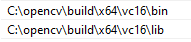
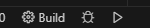

# CameraCPP_OpenCV  

Código fuente en C++ para capturar video desde la cámara, grabar y guardar archivos de video utilizando OpenCV.  

## Instrucciones para compilar en VS Code (Windows)  

### Requisitos  
- **OpenCV 4.10.0** (preferiblemente instalado en `C:\opencv`)  
- **CMake** (última versión disponible)  
- **Developer PowerShell o CMD para VS 2022** (compilador MSVC)  

### Pasos de instalación y compilación  

#### 1. Configurar las variables de entorno  
Agrega las carpetas `bin` y `lib` de OpenCV a la variable de entorno `PATH`:  

Ruta recomendada:  
```
C:\opencv\build\x64\vc16
```
Debe quedar de esta manera:  
  

#### 2. Clonar el repositorio y abrir en VS Code  
Abre **Developer PowerShell for VS 2022**, navega hasta la carpeta donde deseas clonar el proyecto y ejecuta:  
```sh
git clone https://github.com/Minerisho/CameraCPP_OpenCV
cd CameraCPP_OpenCV
code .
```

#### 3. Instalar extensiones en VS Code  
Instala las siguientes extensiones desde la tienda de extensiones de VS Code:  
- **C/C++ Extension Pack**  
- **CMake**  
- **CMake Tools**  

Después de instalar CMake, debería abrirse automáticamente una terminal para descargar y verificar archivos de compilación. Si no ocurre, abre el archivo `CMakeLists.txt` y guárdalo con `Ctrl + S`.  

#### 4. Compilar y ejecutar  
En la parte inferior de VS Code aparecerán los siguientes botones:  
- **"Build" (compilar)**  
- **"Debug" (depuración)**  
- **"Launch" (ejecutar el programa)**  

  

Presiona **Build** para compilar `main.cpp`. Luego, ejecuta **Launch** para abrir la cámara. En la terminal verás instrucciones para grabar y guardar videos.  
